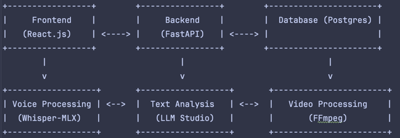

# Проект: KONSPECTO (LLM Агент для работы с конспектами)

## Описание проекта

Данный проект представляет собой интеллектуального агента на базе локальной модели LLM, который решает несколько задач по поиску, анализу и преобразованию информации, исходя из конспектов и видео-лекций. Агент предлагает следующие функции:
1. **Поиск информации по конспектам** – агент ищет релевантные данные на основе входных конспектов и возвращает результат в двух форматах: полный и сокращенный. В результатах также будут присутствовать фрагменты из источников, на которые опирался агент.
2. **Объединение конспектов** – агент может сравнить два конспекта и объединить их на основе тем и содержания, создавая единый документ.
3. **Преобразование видео-лекций в слайды** – агент преобразует видео-лекции в набор изображений (слайдов), представляющих ключевые моменты лекции. Выделение текста от лектора не производится.
4. **Поддержка ввода через голос и текст** – запросы могут подаваться как в текстовом, так и в голосовом формате.

## Стек технологий

### 1. **Frontend**
- **React.js**: динамический интерфейс пользователя для ввода текста и загрузки голосовых запросов.
- **HTML/CSS**: для базовой структуры и стилизации фронтенда.
- **TailwindCSS**: для адаптивной стилизации и быстрого создания пользовательского интерфейса.

### 2. **Backend**
Для логики агента и обработки запросов:
- **Python**: основной язык разработки для создания моделей и реализации функционала агента.
- **FastAPI**: легковесный и быстрый фреймворк для создания API, обеспечивающий взаимодействие фронтенда с бекендом.
- **Celery**: для асинхронной обработки длительных задач, таких как преобразование видео в изображения или объединение конспектов.
- **Redis**: брокер для управления очередями задач в Celery.

### 3. **Обработка Голоса**
Для распознавания голоса:
- **Lightning Whisper-MLX**: модель для конвертации аудиофайлов в текст. Это модифицированная версия Whisper для более быстрой и точной обработки голосовых запросов.
  - Репозиторий: [Lightning Whisper-MLX](https://github.com/mustafaaljadery/lightning-whisper-mlx)

### 4. **Модель обработки текста**
Для поиска, анализа и объединения конспектов используется локальная модель:
- **LLM Studio**: локальная модель, которая будет разворачиваться и предоставляться через LLM-Studio, поддерживая анализ текста, генерацию сокращений и объединение конспектов.

### 5. **Преобразование видео в слайды**
Для преобразования видео-лекций в набор изображений:
- **FFmpeg**: для простого извлечения кадров из видео. Каждое видео будет нарезано на кадры через заданный интервал времени. Это позволит выделить ключевые моменты видео без текстового сопровождения.

### 6. База данных

Для хранения пользовательских конспектов, запросов и результатов обработки:

- **PostgreSQL**: реляционная база данных для хранения информации о конспектах, результатах их анализа и пользовательских запросах.

### 7. Инфраструктура

- **Docker**: все компоненты проекта (API, модели, базы данных и т.д.) будут контейнеризованы с помощью Docker. Это обеспечит изоляцию окружений и легкость в развертывании.
- Использование Docker гарантирует, что все компоненты проекта могут быть запущены с минимальными усилиями вне зависимости от операционной системы.

## Архитектура проекта


### Краткий функционал

1. **Поиск по конспектам**: Запросы принимаются в текстовом или голосовом формате, информация извлекается из конспектов и других источников, с указанием фрагментов.

2. **Объединение конспектов**: Сравнение двух конспектов по темам и создание нового конспекта.

3. **Видео в слайды**: Преобразование видео-лекций в набор ключевых изображений для использования в презентациях.

## Установка и запуск

### Шаг 1: Клонируйте репозиторий

```bash
git clone https://github.com/RomiconEZ/KONSPECTO
cd KONSPECTO
```

### Шаг 2: Запуск приложения
```bash
docker compose up --build
```

---

npm install в frontend

poetry install в backend

docker compose up --build

npm run test

bash tests/run_tests.sh